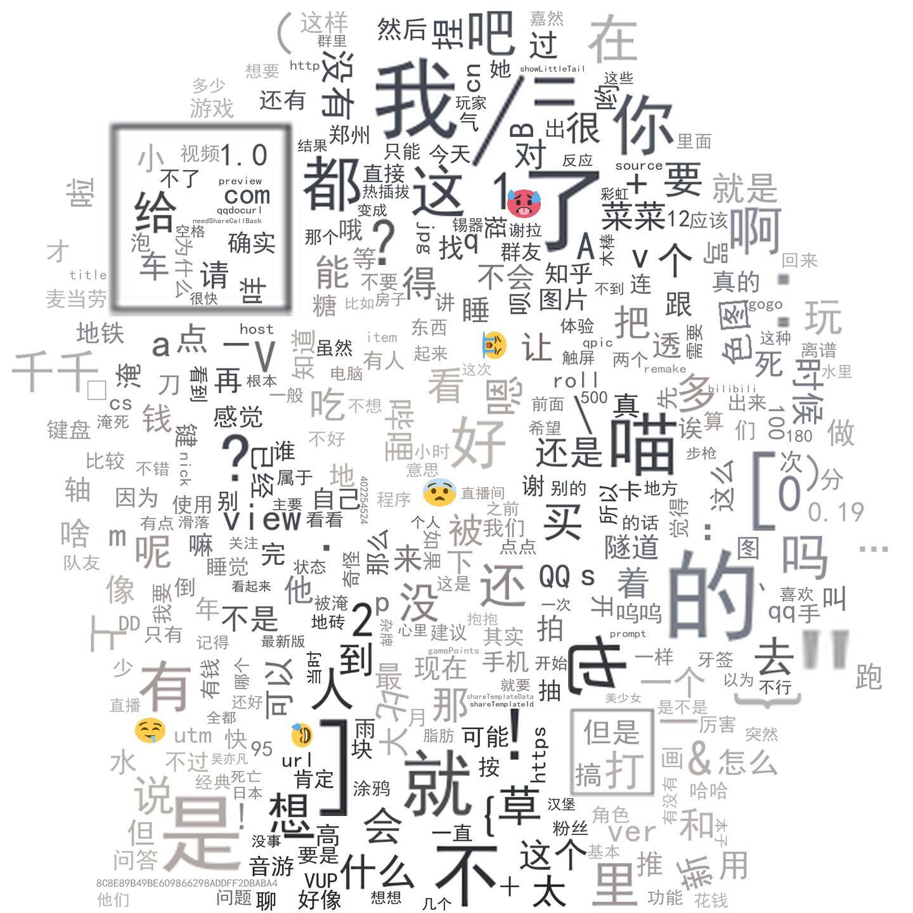
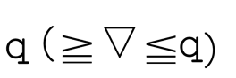
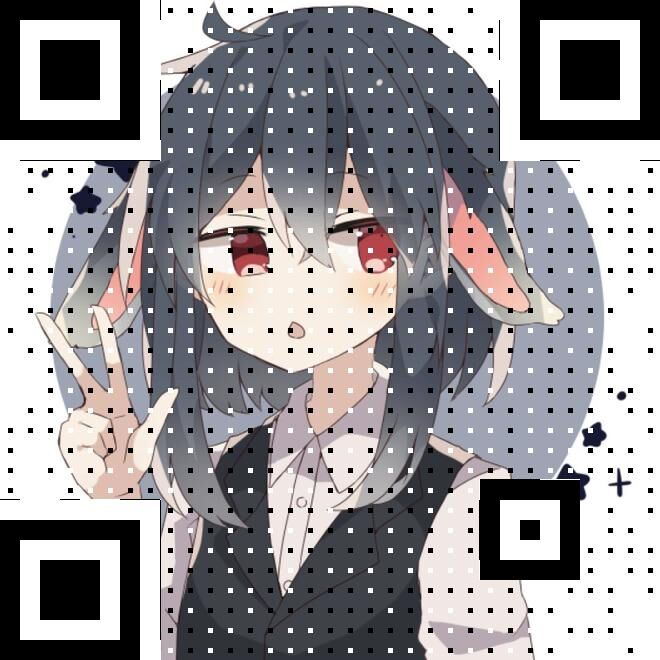

# 关于菜菜

菜菜是千千写的一个QQ bot，主打功能是色图！！由于腾讯以及go-cqhttp框架的限制，当前菜菜已经无法私聊发送图片了呜呜。

菜菜共有四个账号分摊用户，降低冻结的可能性。`3434614020` `2402153471` `3210300894` `515479347`

# 功能帮助

## 色图相关

`/色图` 查看一张菜菜本地的色图。

`/色图 [关键词]`搜索一张菜菜本地的色图。

`/pxsearch [关键词]`搜索pixiv上的图片。

`/pxrank` 查看pixiv今日每周排行。

`/pxrank [模式]`查看pixiv今日的[模式]的排行，模式可以是daily、weekly、monthly分别表示日排行周排行月排行。

`/pxrank [模式] -d [日偏差]` 查看几天前的排行。

`/pxuser [用户名]` 查看用户的作品。

对于`/pxsearch`和`/pxrank`和`/pxuser`，用`-p [页数]`参数进行翻页。

`/pxview [pixiv id]` 查看pixiv插画。

## 经济系统玩法

菜菜玩法中，货币被称作“财布点”，有多种方法可以赚取或者消费。

（以前看色图还需要消费财布点，重写菜菜的时候，就，懒得再加几句代码了，就不用了（懒比））

### 签到

`/签到`进行每日签到

`/状态`查看当前的财布点和好感度

### 抽卡 

菜菜抽卡类似于舰C等等建造类抽卡，只不过资源是直接用财布点买的。设定四种资源的投入进行建造，不同的投入获得不同的抽卡结果。四种资源分别叫做`草莓🍓` `牛奶🥛` `鱼板🍥` `船锚⚓`。

`草莓233牛奶233鱼板233船锚233`进行设定资源投入。`/建造`进行单抽，`/十连`进行十连（送一抽，其实是11连）。

`/我的工艺品`查看所有抽到的卡。

`/出售重复`将库存中重复的物品卖出。

### 打工

输入`/打工状态`查看所有可以进行的打工，输入`去[打工项目名称]`进行打工，会消费打工体力，获得财布点，也可能会触发一些奇奇怪怪的剧情。

# B站相关功能

`/B 用户名` 搜索一位用户。然后根据图片里的提示进行开播、动态的订阅。

`/订阅列表` 查看当前的订阅，根据图片内的提示，进行取关。

`/biliview [BV号]`观看一个B站视频。

`/V拼图`用正在直播的VUP们的头像组成你发送的图片。

# 表情包生成

大部分功能，以发送指令之前用户最近发送的那张图片为基础。

`/表情包`查看一张菜菜收集的大家常发的图片。

`/词云`根据群聊词语频度生成词云图。

`/缩放模糊`生成一张缩放模糊的GIF图。

`/随机扭曲`生成一张随机扭曲了的图片。

`/扭扭`生成一张左右扭来扭曲的图片。

`/扭扭`生成一张歪着扭来扭曲的图片。

`/抖文字 [一段文字]` 生成一张文字抖来抖去的GIF。

`/运动模糊`生成一张震来震去模糊的GIF！！！！

`/旋转`生成一张旋转的GIF。

`/摸摸`生成一张摸摸的GIF。

`/印象色`或者`/色板`提取图片中的主要颜色。如果是`/色板`，颜色的RGB值会被标注在图片上。

`/二维码 [二维码内容]`生成一张二维码。

`/底部字 [内容]`给图片底部标注一段字。

`/变形`这是生成像最近QQ新出的/变形表情的GIF

`/群拼图`用群友们的头像生成你发送的图片，用`/群拼图我在哪`查看自己在图片的哪里。

